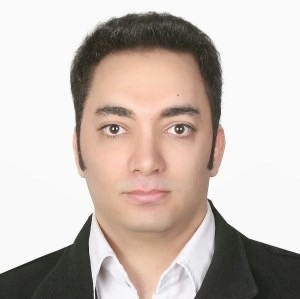

# Seyed Vahid Ghayoomie

**Computational Systems Engineer** · Milan, Italy

Big data · Cloud, DevOps & MLOps · Security & reliability · Machine learning · HPC · Bio-inspired AI

## About me

Computational systems engineer with interdisciplinary expertise in big data architecture, cloud infrastructure, DevOps and MLOps, security and reliability, data science, machine learning, performance-oriented software development, and bio-inspired AI.

Over more than fifteen years, this has included application security and system design for banking and government institutions, the architecture of a national bank's big-data platform and fraud-detection system, the founding and technical leadership of a start-up, and independent consulting in cloud, data and AI.

Keeping up with science is part of my routine. Currently pursuing my continuing education through a Master's in High Performance Computing Engineering at Politecnico di Milano, with research interests in scalable simulation systems, parallel computing, and emerging quantum machine learning paradigms.

## Research

About 20% of my time, including evenings and weekends, is dedicated to science. For more than ten years this has ranged from computational biology and neuroscience to mathematics, physics and robotics, with a long-term focus on bio-inspired AI and quantum computing.

- **OpenWorm Foundation**: senior contributor since 2014; proposed and led [ChannelWorm](https://github.com/openworm/ChannelWorm), integrating data and models for ion channels in *C. elegans*
- **[wormsim2](https://github.com/VahidGh/wormsim2)**: real-time *C. elegans* neuromechanical simulator in modern C++ with CUDA, OpenCL and OpenMP, run on CINECA's Galileo100 ([3D viewer](https://vahidgh.github.io/wormsim2/))
- **[AstraLog-HPC](https://vahidgh.github.io/ghayoomie-se4hpc/)**: C++17 telemetry anomaly-detection pipeline built as one full software-engineering cycle, from requirements to SLURM runs
- **[chModeler](https://github.com/VahidGh/chModeler)** and **[MatNeuron](https://github.com/VahidGh/MatNeuron)**: ion-channel modelling, and a web-based simulation environment that bridges neural networks with biomechanical systems

**Publications and talks:** [OpenWorm: overview and recent advances in integrative biological simulation of *Caenorhabditis elegans*](https://doi.org/10.1098/rstb.2017.0382) (Phil. Trans. R. Soc. B, 2018) · [Unit testing, model validation, and biological simulation](https://doi.org/10.12688/f1000research.9315.1) (F1000Research, 2016) · Invited talk at The Royal Society, London, 2018

## Contact

[vahidgh.github.io](https://vahidgh.github.io) · [CV (PDF)](cv/CV-SeyedVahidGhayoomie.pdf) · [LinkedIn](https://www.linkedin.com/in/vahid-ghayoomie) · [vahidghayoomi@gmail.com](mailto:vahidghayoomi@gmail.com)

This repository holds the source of my personal site, published with GitHub Pages at https://vahidgh.github.io.
